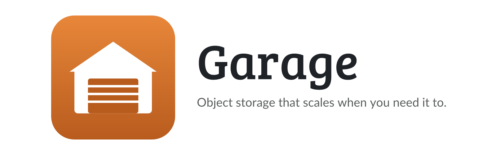

<picture>
  <source media="(prefers-color-scheme: dark)" srcset=".github/assets/banner-dark.png">
  
</picture>

<p align="center">
  <a href="https://github.com/junkerderprovinz/garage/actions/workflows/build.yml"></a>&nbsp;
  <a href="https://git.deuxfleurs.fr/Deuxfleurs/garage"></a>&nbsp;
  <a href="https://github.com/khairul169/garage-webui"></a>&nbsp;
  <a href="https://unraid.net"></a>&nbsp;
  <a href="LICENSE"></a>
</p>

<p align="center">
<b>Garage</b> — a lightweight, S3-compatible distributed object store — plus its
web admin panel, bundled into <b>one container</b> for Unraid. Both are the
official upstream binaries, unmodified, wired together with s6-overlay. No
manual CLI setup: single-node layout, S3 key and bucket are all created
automatically on first boot.
</p>

<br>

<p align="center">
  <a href="https://buymeacoffee.com/junkerderprovinz">
    
  </a>
</p>

<br>

## Table of Contents

1. [Why one container?](#1-why-one-container)
2. [What is this?](#2-what-is-this)
3. [Quick Start on Unraid](#3-quick-start-on-unraid)
4. [Connecting a client](#4-connecting-a-client)
5. [Configuration](#5-configuration)
6. [Backup](#6-backup)
7. [Support this project](#7-support-this-project)

<br>

## 1. Why one container?

Garage's own [Community Applications listings](https://forums.unraid.net/) are split
across three separate templates from one maintainer: the core server (in two
network variants) and the web admin panel as its own install. This template
bundles the core server *and* the admin panel into one container — both
official, unmodified upstream binaries, no rebuild from source — so one
install gives you a working, browsable S3 store.

<br>

## 2. What is this?

[Garage](https://git.deuxfleurs.fr/Deuxfleurs/garage) is a lightweight,
S3-API-compatible object store built for small, geo-distributed self-hosted
deployments — Rust, Apache-2.0, actively developed. This template runs it in
**single-node mode** (Garage's own `--single-node` flag, introduced in v2.3.0),
which auto-creates the cluster layout at startup — the manual `garage layout
assign` / `garage layout apply` steps a bare install normally requires are not
needed here. An S3 access key, secret key and bucket are pre-seeded from the
template fields on first boot (Garage's `--default-access-key` /
`--default-bucket` flags), so there is no second CLI step to create them either.

[garage-webui](https://github.com/khairul169/garage-webui) runs alongside it,
talking to Garage's admin API over `localhost` — buckets, keys and cluster
health are all browsable without touching a terminal.

<br>

## 3. Quick Start on Unraid

1. Install from Community Applications, or add this template's URL directly:
   `https://raw.githubusercontent.com/junkerderprovinz/garage/main/templates/garage.xml`
2. Set **Access Key** and **Secret Key** — anything reasonably random works, e.g.
   generate a secret with `openssl rand -hex 24`.
3. Optionally set **Bucket** to a name you want created immediately (e.g. `backups`).
4. Start the container. The S3 endpoint is `http://SERVER_IP:3900`; the admin
   panel is at `http://SERVER_IP:3909`.

Watch the container log for `GARAGE IS READY` — first boot generates the
config and layout, this takes a few seconds.

<br>

## 4. Connecting a client

Any S3-compatible tool works. A couple of common ones:

**rclone** (`rclone config`, or a config file entry):
```ini
[garage]
type = s3
provider = Other
access_key_id = YOUR_ACCESS_KEY
secret_access_key = YOUR_SECRET_KEY
endpoint = http://SERVER_IP:3900
region = garage
```

**restic** (repository URL):
```bash
export AWS_ACCESS_KEY_ID=YOUR_ACCESS_KEY
export AWS_SECRET_ACCESS_KEY=YOUR_SECRET_KEY
restic -r s3:http://SERVER_IP:3900/my-restic-repo init
```

<br>

## 5. Configuration

| Setting | Container Variable | Default | Notes |
|---|---|---|---|
| S3 API Port | (port) | `3900` | The functional endpoint every client connects to. |
| S3 Website Port | (port) | `3902` | Advanced. Static-site hosting straight from a bucket. |
| Admin Panel Port | (port) | `3909` | Browser UI: buckets, keys, cluster health. |
| Data | (path) | `/mnt/user/appdata/garage/data` | Object data + metadata. Must be mapped. |
| Config | (path) | `/mnt/user/appdata/garage/config` | Generated `garage.toml` (RPC secret, admin token). Must be mapped — losing it changes your RPC/admin secrets on next boot. |
| Access Key | `ACCESS_KEY` | *(empty)* | S3 access key, pre-seeded on first boot. Required to write anything real. |
| Secret Key | `SECRET_KEY` | *(empty)* | S3 secret key, pre-seeded on first boot. |
| Bucket | `BUCKET` | *(empty)* | Bucket name to create automatically on first boot. Leave empty to create buckets later via the admin panel or any S3 client. |
| DB Engine | `DB_ENGINE` | `sqlite` | Garage's metadata engine. `lmdb` is faster but less tolerant of an unclean shutdown; `sqlite` is the safer default. |

Ports 3901 (Garage's internal RPC) and 3903 (the admin API garage-webui talks
to) are intentionally **not** published — nothing outside the container needs
them directly.

<br>

## 6. Backup

Everything lives under the **Data** and **Config** mounts — back both up the
same way you back up any other appdata folder. Losing **Config** does not lose
your objects, but it does regenerate the RPC secret and admin token on next
boot, which breaks the admin panel's stored session and (for a real
multi-node cluster, not this single-node setup) cluster membership.

<br>

## 7. Support this project

Questions, bugs, ideas? **[GitHub issues →](https://github.com/junkerderprovinz/garage/issues)**.

If this template saves you a setup hassle, consider buying me a coffee:

<p align="center">
  <a href="https://buymeacoffee.com/junkerderprovinz">
    
  </a>
</p>
