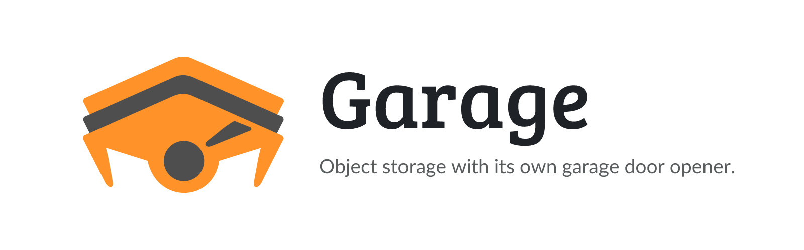
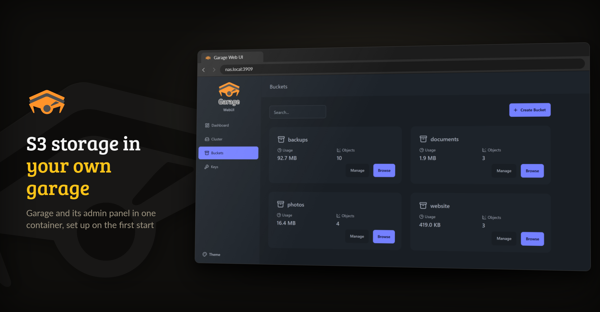
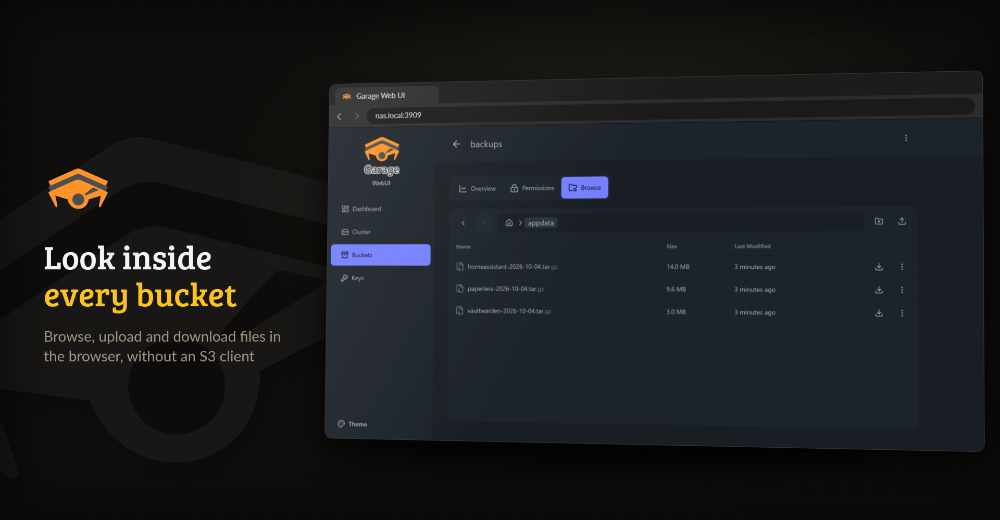

<picture>
  <source media="(prefers-color-scheme: dark)" srcset=".github/assets/banner-dark.png">
  
</picture>

<p align="center">
  <a href="https://github.com/junkerderprovinz/garage/actions/workflows/build.yml"></a>&nbsp;
  <a href="https://git.deuxfleurs.fr/Deuxfleurs/garage"></a>&nbsp;
  <a href="https://github.com/khairul169/garage-webui"></a>&nbsp;
  <a href="https://ca.unraid.net/apps/garage-17mn9vl03a3cot"></a>&nbsp;
  <a href="LICENSE"></a>
</p>

<p align="center">
<b>Garage</b>, a lightweight, S3-compatible distributed object store, plus its
web admin panel, bundled into <b>one container</b> for Unraid. Both are the
official upstream binaries, unmodified, wired together with s6-overlay. No
manual CLI setup: single-node layout, S3 key and bucket are all created
automatically on first boot.
</p>

<!-- download-buttons: written by scripts/gen_download_buttons.py -->
<p align="center">
  <a href="https://ca.unraid.net/apps/garage-17mn9vl03a3cot"></a>
  &nbsp;
  <a href="https://hub.docker.com/r/junkerderprovinz/garage/"></a>
  &nbsp;
  <a href="https://github.com/junkerderprovinz/garage/releases/latest"></a>
</p>
<!-- /download-buttons -->

<br>

<p align="center">
A one-knight job: I build it, keep it running, work through the issues and add what people ask for, until nothing is missing. It is free, with no accounts, no telemetry, no ads and no paid tier. No asterisk anywhere. Nothing readable ever leaves your own walls. Forged on evenings and weekends, with heart and stubbornness.
</p>

<p align="center">
If it has earned a place on your server or computer, toss a coin to your knight: it helps cover the costs and keeps the project alive. It also makes this knight's heart beat a little faster. Three ways below, whichever suits you.
</p>

<!-- give-buttons: written by scripts/gen_download_buttons.py -->
<p align="center">
  <a href="https://buymeacoffee.com/junkerderprovinz"></a>
  &nbsp;
  <a href="https://www.paypal.com/donate/?hosted_button_id=76FVV52TKXTUS"></a>
  &nbsp;
  <a href="https://junkerderprovinz.github.io/junkerderprovinz/"></a>
</p>
<!-- /give-buttons -->

<br>

## Table of Contents

1. [What it looks like](#1-what-it-looks-like)
2. [What it does](#2-what-it-does)
3. [Getting started](#3-getting-started)
4. [How AI is used here](#4-how-ai-is-used-here)
5. [Support this project](#5-support-this-project)

<br>

## 1. What it looks like

The buckets, keys and files in these pictures are made up.

<p align="center">
  
  <br><em>The admin panel lists every bucket with its size and object count</em>
</p>

<p align="center">
  
  <br><em>The object browser opens any bucket, with upload and download in the browser</em>
</p>

<br>

## 2. What it does

- **Garage and its admin panel in one install.** [Garage](https://git.deuxfleurs.fr/Deuxfleurs/garage) is a lightweight, S3-compatible object store. [garage-webui](https://github.com/khairul169/garage-webui) runs beside it in the same container, so buckets, keys and cluster health are one click away. Garage's own Community Applications listings split the server and the panel across three templates; this is one.
- **No terminal step.** The container runs Garage in single-node mode, which creates the cluster layout by itself. The access key, the secret key and a first bucket come from the template fields on the first start.
- **The official binaries, unmodified.** Both are copied from their upstream images and wired together with s6-overlay. None of it is rebuilt from source.
- **Any S3 client works.** rclone, restic, Kopia, Duplicati or your backup tool of choice talk to port 3900.

<br>

## 3. Getting started

On Unraid, install Garage from [Community Applications](https://ca.unraid.net/apps/garage-17mn9vl03a3cot), fill in an access key and a secret key, and start it. Anywhere else, one container is enough:

```sh
docker run -d --name garage -p 3900:3900 -p 3909:3909 \
  -e ACCESS_KEY=GK$(openssl rand -hex 12) \
  -e SECRET_KEY=$(openssl rand -hex 32) \
  -e BUCKET=backups \
  -v /path/to/config:/config \
  -v /path/to/data:/data \
  junkerderprovinz/garage:latest
```

The log says `GARAGE IS READY` once it is up. The S3 endpoint is `http://<server>:3900` with the region `garage`, and the admin panel is on port 3909. An rclone remote for it looks like this:

```ini
[garage]
type = s3
provider = Other
access_key_id = YOUR_ACCESS_KEY
secret_access_key = YOUR_SECRET_KEY
endpoint = http://<server>:3900
region = garage
```

Back up `/config` and `/data` together. Losing `/config` keeps your objects but generates a new admin token and RPC secret on the next start.

<br>

## 4. How AI is used here

One knight builds this, and AI is one of the tools I work with, the same way I work with an editor or a compiler. It helps me write code and documentation and it checks my work, and that saves me a good many evenings. It does not make the decisions, though. I read and understand everything before it ships, and if something here breaks, that is on me and not on the tool.

You do not have to take my word for it. The code is open and every release note is written by hand. The issue tracker shows how problems actually get handled, including the ones I got wrong the first time. If you find something that is not right, open an issue and I will look at it.

<br>

## 5. Support this project

Questions? Check the [support thread](https://forums.unraid.net/topic/198811-support-junkerderprovinz-unraid-apps/). Bugs, ideas or feature requests? Please [open a GitHub issue](https://github.com/junkerderprovinz/garage/issues).

A one-knight job: I build it, keep it running, work through the issues and add what people ask for, until nothing is missing. It is free, with no accounts, no telemetry, no ads and no paid tier. No asterisk anywhere. Nothing readable ever leaves your own walls. Forged on evenings and weekends, with heart and stubbornness.

If it has earned a place on your server or computer, toss a coin to your knight: it helps cover the costs and keeps the project alive. It also makes this knight's heart beat a little faster. Three ways below, whichever suits you.

<!-- give-buttons: written by scripts/gen_download_buttons.py -->
<p align="center">
  <a href="https://buymeacoffee.com/junkerderprovinz"></a>
  &nbsp;
  <a href="https://www.paypal.com/donate/?hosted_button_id=76FVV52TKXTUS"></a>
  &nbsp;
  <a href="https://junkerderprovinz.github.io/junkerderprovinz/"></a>
</p>
<!-- /give-buttons -->

<sub>Garage is made by Deuxfleurs and garage-webui by khairul169; both ship here unmodified under their own licences.</sub>
